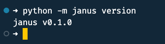
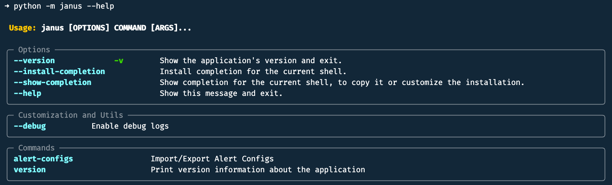
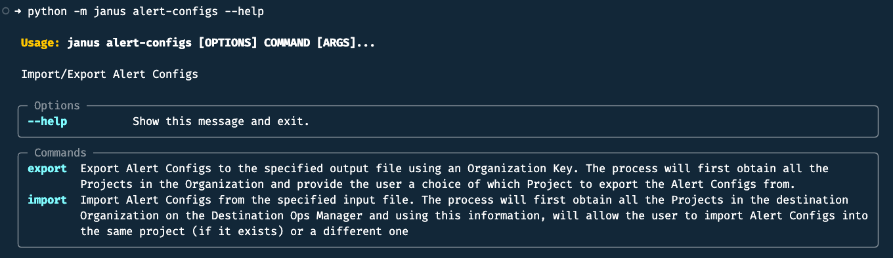
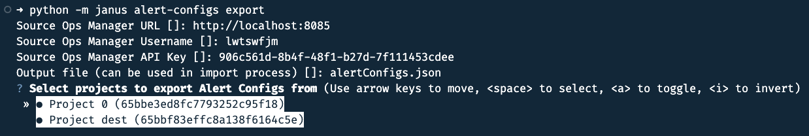
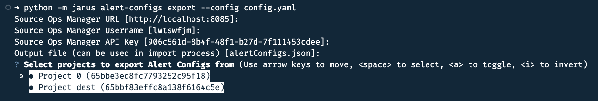
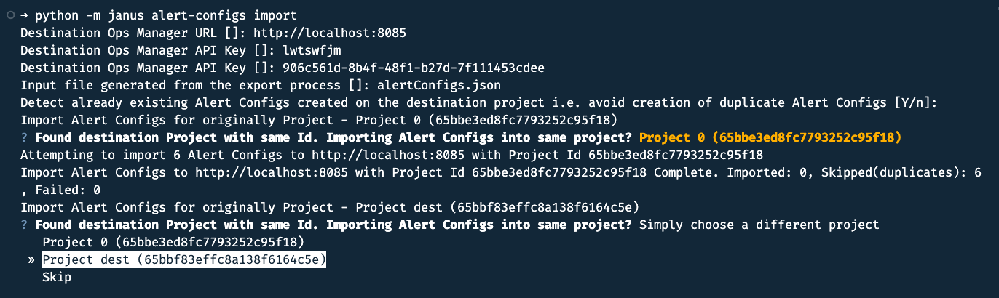
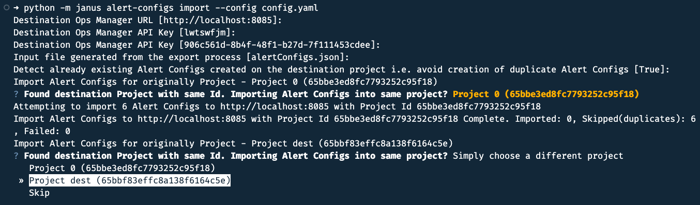

## Introduction
Janus is a small tool build with Python, typer and questionary to export resources from a [MongoDB Ops Manager](https://www.mongodb.com/docs/ops-manager/current/) instance and import them into another using the [Ops Manager API](https://www.mongodb.com/docs/ops-manager/current/core/api/). At this time, Janus can only export/import Alert Configuration

### About the name - Janus
In ancient Roman religion and myth, [Janus](https://en.wikipedia.org/wiki/Janus) is the god of beginnings, gates, transitions, time, duality, doorways, passages, frames, and endings.  We hope that Janus will look over the transition of the Alert Configurations.

## Python Versions

Developed and tested using,

- Python v3.11.5
- Pip v23.3.2

## Installation

```bash
git clone https://github.com/edmallia/om-janus.git
cd om-janus
pip install -r requirements.txt
```

## Running Janus
### Check version

```bash
python -m janus version
```



### Show help

```bash
python -m janus --help
```



### Show help for Alert Configs subcommand

```bash
python -m janus alert-configs --help
```



### Export Alert Configs

```bash
python -m janus alert-configs export
```
Following on screen instructions.




### Export Alert Configs using a Configuration file

```bash
python -m janus alert-configs export --config config.yaml
```



Following on screen instructions.

### Import Alert Configs

``` bash
python -m janus alert-configs import
```



Following on screen instructions.

### Import Alert Configs using a Configuration file

``` bash
python -m janus alert-configs import --config config.yaml
```

Following on screen instructions.



### Sample Configuration file

```yaml
sourceUrl: http://localhost:8080
sourceUsername: xxxxxxxx
sourceApiKey: 00000000-0000-0000-0000-000000000000
outputFile: alertConfigs.json

destinationUrl: http://localhost:8080
destinationUsername: xxxxxxxx
destinationApiKey: 00000000-0000-0000-0000-000000000000
detectAndSkipDuplicates: true
inputFile: alertConfigs.json
```
